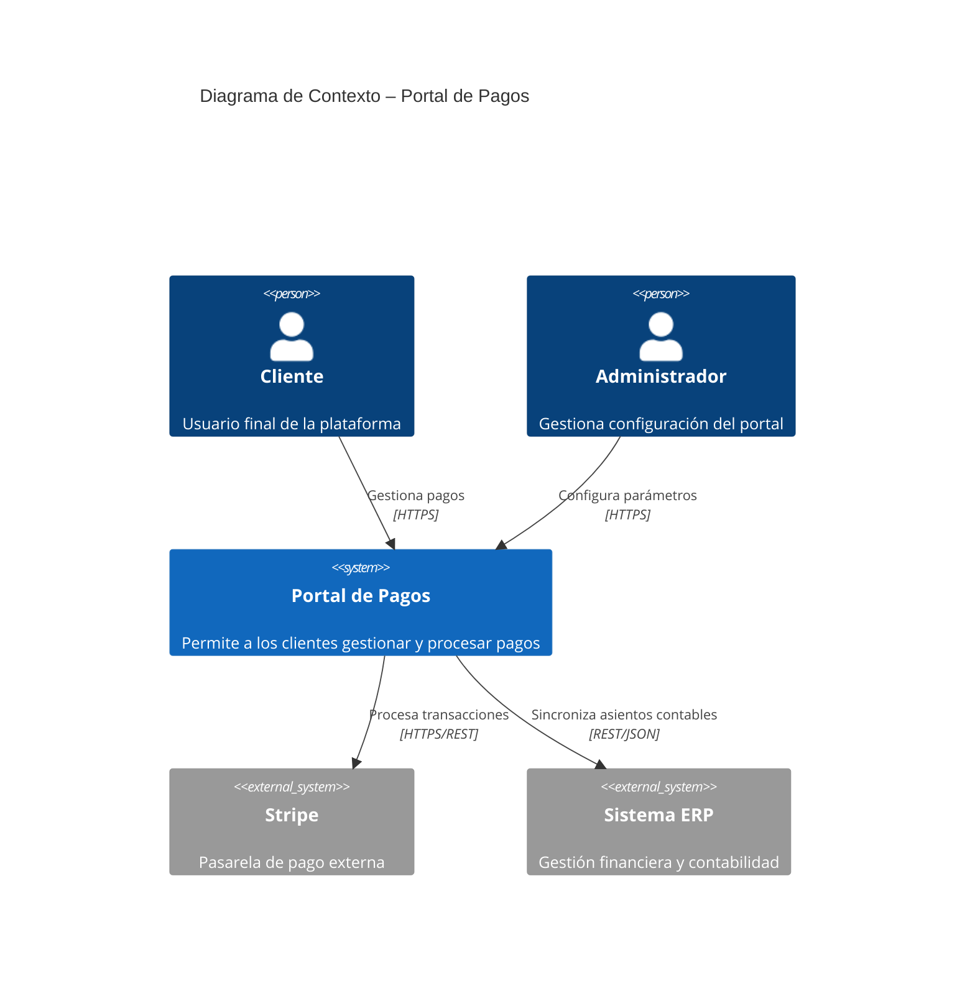

# Diagramas C4

**Estado:** WIP

---

## Tabla de Contenidos

1. [Introducción](#introducción)
2. [El Modelo C4](#el-modelo-c4)
3. [Nivel 1 – Diagrama de Contexto del Sistema](#nivel-1--diagrama-de-contexto-del-sistema)
4. [Nivel 2 – Diagrama de Contenedores](#nivel-2--diagrama-de-contenedores)
5. [Nivel 3 – Diagrama de Componentes](#nivel-3--diagrama-de-componentes)
6. [Nivel 4 – Diagrama de Código](#nivel-4--diagrama-de-código)
7. [Notación y Convenciones Visuales](#notación-y-convenciones-visuales)
8. [Herramientas Recomendadas](#herramientas-recomendadas)
9. [Plantillas y Ejemplos](#plantillas-y-ejemplos)
10. [Reglas de Gobierno](#reglas-de-gobierno)
11. [Glosario](#glosario)

---

## Introducción

El modelo C4, creado por Simon Brown, es un enfoque jerárquico para documentar la arquitectura de software. Proporciona un conjunto de niveles de abstracción que permiten comunicar la arquitectura tanto a audiencias técnicas como no técnicas.

### ¿Por qué C4?

El modelo C4 resuelve problemas comunes en la documentación de arquitectura:

- Los diagramas UML tradicionales suelen ser demasiado detallados o demasiado abstractos.
- Los diagramas informales (cajas y flechas sin semántica clara) generan ambigüedad.
- C4 define una jerarquía clara: **Context → Container → Component → Code**.
- Facilita conversaciones entre arquitectos, desarrolladores, product managers y stakeholders.

### Principios Rectores

1. **Claridad sobre completitud**: un diagrama que se entiende en 30 segundos vale más que uno exhaustivo que nadie lee.
2. **Audiencia primero**: cada nivel tiene una audiencia definida; nunca mezcles abstracciones.
3. **Diagramas vivos**: los diagramas deben actualizarse junto con el código, no generarse una sola vez.
4. **Texto como complemento**: cada diagrama debe ir acompañado de una descripción breve.
5. **Consistencia visual**: usar la misma paleta de colores, formas y tipografía en todos los diagramas del proyecto.

---

## El Modelo C4

| Nivel | Nombre | Audiencia principal | Pregunta que responde |
|-------|--------|--------------------|-----------------------|
| 1 | Contexto del Sistema | Todos (técnicos y no técnicos) | ¿Qué hace el sistema y quién lo usa? |
| 2 | Contenedores | Arquitectos, líderes técnicos | ¿Cómo está desplegado el sistema en alto nivel? |
| 3 | Componentes | Desarrolladores | ¿Cómo está organizado internamente cada contenedor? |
| 4 | Código | Desarrolladores (opcional) | ¿Cómo está implementado cada componente? |

> **Regla de oro**: no todos los sistemas necesitan los cuatro niveles. Los niveles 1 y 2 son obligatorios; el nivel 3 es recomendado; el nivel 4 es opcional y solo para componentes críticos.

---

## Nivel 1 – Diagrama de Contexto del Sistema

### Propósito

Mostrar el sistema como una caja negra dentro de su entorno: los usuarios que lo utilizan y los sistemas externos con los que interactúa.

### Elementos permitidos

| Elemento | Descripción | Forma estándar |
|----------|-------------|----------------|
| **Sistema** | El sistema que se está documentando | Caja con borde doble o color primario |
| **Usuario / Persona** | Actor humano que interactúa con el sistema | Figura de persona o caja con ícono |
| **Sistema externo** | Sistema fuera del alcance del equipo | Caja con relleno gris o borde punteado |
| **Relación** | Interacción entre elementos | Flecha con etiqueta descriptiva |

### Reglas

- Incluir **solo** actores y sistemas directamente relacionados con el sistema documentado.
- Cada relación debe tener una etiqueta que describa **qué** se comunica y con qué protocolo/tecnología (ej. `"Envía notificaciones por email [SMTP]"`).
- No incluir detalles de implementación (bases de datos, lenguajes, frameworks).
- El nombre del sistema debe ser un sustantivo concreto, no un acrónimo sin definir.
- Mantener el número de elementos entre **5 y 15**; si hay más, dividir en subdiagramas.

### Lista de verificación

- [ ] El sistema central está identificado claramente.
- [ ] Todos los usuarios/personas tienen un nombre descriptivo de su rol.
- [ ] Los sistemas externos están etiquetados con su nombre oficial.
- [ ] Todas las relaciones tienen etiqueta con tecnología o protocolo.
- [ ] No hay detalles de implementación interna.

### Ejemplo de descripción

```
Sistema: Portal de Pagos
Usuarios: Cliente final, Administrador de tesorería
Sistemas externos: Pasarela de pago (Stripe), Sistema ERP, Proveedor de autenticación (OAuth 2.0)
```

---

## Nivel 2 – Diagrama de Contenedores

### Propósito

Mostrar la arquitectura de despliegue en alto nivel: las aplicaciones, servicios y almacenes de datos que componen el sistema, y cómo se comunican entre sí.

### Definición de Contenedor

Un **contenedor** es una unidad desplegable de forma independiente que ejecuta código o almacena datos. Ejemplos:

- Aplicación web (frontend SPA, SSR)
- API REST / GraphQL
- Aplicación móvil
- Base de datos relacional o NoSQL
- Cola de mensajes
- Caché distribuida
- Función serverless / Lambda
- Microservicio

> Un contenedor **no** es un contenedor Docker (aunque puede serlo). Es cualquier proceso o almacén desplegable de forma independiente.

### Elementos permitidos

| Elemento | Descripción | Forma estándar |
|----------|-------------|----------------|
| **Contenedor** | Unidad desplegable | Caja con nombre, tecnología y responsabilidad |
| **Persona / Sistema externo** | Heredado del nivel 1 (atenuado) | Igual al nivel 1, pero con menor prominencia visual |
| **Relación** | Comunicación entre contenedores | Flecha con etiqueta: qué + cómo (protocolo) |

### Información obligatoria por contenedor

Cada caja de contenedor debe incluir:

1. **Nombre**: identificador único y descriptivo.
2. **Tecnología**: lenguaje, framework o plataforma (ej. `React 18`, `Node.js + Express`, `PostgreSQL 15`).
3. **Responsabilidad**: una oración de máximo 15 palabras que explique qué hace.

### Reglas

- No mezclar contenedores con componentes internos.
- Las relaciones entre contenedores deben especificar el protocolo: `HTTP/REST`, `gRPC`, `AMQP`, `WebSocket`, `JDBC`, etc.
- Indicar dirección de las flechas (quién inicia la comunicación).
- Los sistemas externos del nivel 1 pueden aparecer en gris, sin detalle interno.
- Si hay más de **20 contenedores**, considerar dividir por dominio o bounded context.

### Lista de verificación

- [ ] Cada contenedor tiene nombre, tecnología y responsabilidad.
- [ ] Las relaciones indican protocolo y dirección.
- [ ] No hay lógica de negocio en las etiquetas (solo comunicación).
- [ ] Los contenedores externos al equipo están visualmente diferenciados.
- [ ] El diagrama es consistente con el nivel 1.

---

## Nivel 3 – Diagrama de Componentes

### Propósito

Mostrar la estructura interna de un contenedor: los componentes principales, sus responsabilidades y sus interacciones.

### Definición de Componente

Un **componente** es una agrupación de código relacionado con una responsabilidad bien definida, expuesta a través de una interfaz. Puede ser:

- Un módulo o paquete
- Un servicio de aplicación (en DDD o Hexagonal)
- Un controlador (MVC)
- Un repositorio o adaptador
- Una librería interna

### Elementos permitidos

| Elemento | Descripción |
|----------|-------------|
| **Componente** | Agrupación de código con responsabilidad única |
| **Contenedor externo** | Otros contenedores que interactúan (del nivel 2, atenuados) |
| **Sistema externo** | Sistemas de terceros relevantes para este contenedor |
| **Relación** | Dependencia o llamada entre componentes |

### Información obligatoria por componente

1. **Nombre**: sustantivo que describe la responsabilidad.
2. **Tecnología / Patrón**: ej. `Spring @Service`, `Express Router`, `Repository Pattern`.
3. **Responsabilidad**: una oración breve.

### Reglas

- Un diagrama de componentes aplica a **un solo contenedor** a la vez.
- No entrar en detalles de clases o métodos (eso es nivel 4).
- Seguir los patrones de arquitectura del proyecto (Hexagonal, Capas, CQRS, etc.).
- Los componentes deben corresponderse con módulos reales del código (no componentes ideales).
- Limitar a **10–20 componentes** por diagrama; si hay más, subdividir.

### Lista de verificación

- [ ] El diagrama está asociado a un único contenedor.
- [ ] Los componentes reflejan el código real.
- [ ] Se indica el patrón arquitectónico seguido.
- [ ] Las dependencias tienen dirección y propósito claro.
- [ ] El diagrama es consistente con el nivel 2.

---

## Nivel 4 – Diagrama de Código

### Propósito

Mostrar la implementación interna de un componente usando notación UML (clases, interfaces, relaciones de herencia/composición).

### Cuándo usarlo

El nivel 4 es **opcional** y se recomienda solo para:

- Componentes con lógica compleja o patrones de diseño no evidentes.
- Módulos críticos que requieren revisión formal de arquitectura.
- Onboarding de nuevos desarrolladores en componentes clave.
- Documentación de patrones reutilizables (ej. Strategy, Observer, Factory).

### Reglas

- Usar notación UML estándar (diagrama de clases).
- Incluir solo las clases e interfaces más relevantes; omitir getters/setters triviales.
- Mantener sincronizado con el código (preferir generación automática desde el código).
- No es necesario para todos los componentes; priorizar los de mayor complejidad.

---

## Notación y Convenciones Visuales

### Paleta de Colores Estándar

| Elemento | Color de fondo | Color de texto | Borde |
|----------|---------------|----------------|-------|
| Sistema propio | `#1168BD` (azul) | `#FFFFFF` | — |
| Persona / Usuario | `#08427B` (azul oscuro) | `#FFFFFF` | — |
| Contenedor | `#438DD5` (azul claro) | `#FFFFFF` | — |
| Componente | `#85BBF0` (azul pálido) | `#000000` | — |
| Sistema externo | `#999999` (gris) | `#FFFFFF` | — |
| Base de datos | `#438DD5` con ícono cilindro | `#FFFFFF` | — |

> Estos colores siguen la paleta oficial de C4 (c4model.com). Se pueden adaptar a la guía de marca del proyecto, pero deben mantenerse **consistentes** en todos los diagramas del repositorio.

### Tipografía

- Fuente: sans-serif (Roboto, Inter, Open Sans o equivalente del sistema).
- Nombre del elemento: **negrita**, 14–16 px.
- Tecnología: cursiva o corchetes, 12 px, ej. `[PostgreSQL 15]`.
- Responsabilidad: texto normal, 12 px.
- Etiqueta de relación: 11–12 px, sobre o bajo la flecha.

### Flechas y Relaciones

- Usar flechas **sólidas** para dependencias síncronas (HTTP, gRPC, llamadas directas).
- Usar flechas **punteadas** para dependencias asíncronas (eventos, mensajes, colas).
- La punta de la flecha indica el **destino** de la comunicación o dependencia.
- Toda flecha debe tener una etiqueta; flechas sin etiquetar no están permitidas.

### Formato de Etiqueta de Relación

```
[Verbo que describe la acción] [tecnología/protocolo entre corchetes]
Ejemplos:
  "Autentica usuarios [HTTPS/OAuth 2.0]"
  "Publica eventos de pago [AMQP / RabbitMQ]"
  "Consulta inventario [REST API / JSON]"
  "Persiste órdenes [JDBC / SQL]"
```

---

## Herramientas Recomendadas

### Diagramas como Código (recomendado)

Preferir herramientas que permitan versionar los diagramas junto al código fuente.

| Herramienta | Formato | Notas |
|-------------|---------|-------|
| **Structurizr DSL** | Texto (DSL propio) | Herramienta oficial de C4; soporte completo del modelo |
| **Mermaid** | Markdown | Integrado en GitHub, GitLab, Notion; soporte C4 básico |
| **PlantUML + C4-PlantUML** | Texto | Ampliamente adoptado; requiere librería C4 |
| **Diagrams as Code (Python)** | Python | Útil para infraestructura cloud |

### Ejemplo mínimo en Structurizr DSL

```dsl
workspace {
  model {
    user = person "Cliente" "Usuario final de la plataforma"
    
    softwareSystem = softwareSystem "Portal de Pagos" {
      webApp = container "Aplicación Web" {
        technology "React 18"
        description "Interfaz de usuario para gestión de pagos"
      }
      api = container "API de Pagos" {
        technology "Node.js + Express"
        description "Procesa y orquesta las transacciones de pago"
      }
      db = container "Base de Datos" {
        technology "PostgreSQL 15"
        description "Almacena transacciones y configuraciones"
        tags "Database"
      }
    }
    
    stripeGateway = softwareSystem "Stripe" "Pasarela de pago externa" {
      tags "External System"
    }
    
    user -> webApp "Gestiona pagos [HTTPS]"
    webApp -> api "Realiza solicitudes [REST / JSON]"
    api -> db "Lee y escribe transacciones [JDBC]"
    api -> stripeGateway "Procesa cargos [HTTPS / REST]"
  }
  
  views {
    systemContext softwareSystem "Contexto" {
      include *
      autolayout lr
    }
    container softwareSystem "Contenedores" {
      include *
      autolayout lr
    }
    styles {
      element "External System" {
        background #999999
        color #ffffff
      }
      element "Database" {
        shape Cylinder
      }
    }
  }
}
```

### Ejemplo mínimo en Mermaid (C4)



### Herramientas GUI (para exploración inicial)

| Herramienta | Notas |
|-------------|-------|
| **Structurizr (web)** | Editor visual oficial de C4 |
| **draw.io** | Con la biblioteca C4 importada |
| **Lucidchart** | Plantillas C4 disponibles |

> **Nota**: los diagramas GUI deben exportarse como imagen **y** mantenerse en su formato fuente dentro del repositorio.

---

## Plantillas y Ejemplos

### Estructura de Carpetas Recomendada

```
docs/
└── architecture/
    ├── README.md               # Índice de diagramas y contexto del proyecto
    ├── decisions/              # Architecture Decision Records (ADRs)
    │   └── ADR-001-*.md
    ├── c4/
    │   ├── workspace.dsl       # Fuente principal (Structurizr DSL)
    │   ├── level1-context.png  # Exportación nivel 1
    │   ├── level2-containers.png
    │   ├── level3-api.png      # Un archivo por contenedor documentado
    │   └── level3-web.png
    └── diagrams/               # Diagramas complementarios (secuencia, ER, etc.)
```

### Plantilla de Descripción de Diagrama

Cada diagrama debe incluir un bloque de descripción en el README o documento asociado:

```markdown
## [Nombre del Diagrama]

**Nivel C4:** [1 – Contexto | 2 – Contenedores | 3 – Componentes | 4 – Código]  
**Sistema / Contenedor:** [Nombre del sistema o contenedor documentado]  
**Última actualización:** [Fecha]  
**Autor:** [Nombre o equipo]

### Descripción

[2–4 oraciones explicando el propósito del diagrama y las decisiones clave que ilustra.]

### Decisiones clave ilustradas

- [Decisión 1]
- [Decisión 2]

### Diagrama


> Fuente editable: `./ruta/al/archivo.dsl` o `./ruta/al/archivo.mmd`
```

---

## Reglas de Gobierno

### Obligaciones del Equipo

| Rol | Responsabilidad |
|-----|----------------|
| **Arquitecto / Tech Lead** | Mantener los niveles 1 y 2 actualizados. Revisar los niveles 3 en PR. |
| **Desarrollador** | Actualizar el nivel 3 al agregar o modificar componentes. Crear nivel 4 solo si se requiere. |
| **Product Manager** | Revisar el nivel 1 para validar actores y sistemas externos. |

### Ciclo de Vida de los Diagramas

1. **Creación**: junto con el diseño inicial del sistema o feature.
2. **Revisión**: como parte del proceso de Pull Request para cambios arquitectónicos.
3. **Actualización**: obligatoria cuando cambia la estructura (no el comportamiento).
4. **Depreciación**: marcar como `[DEPRECADO]` con fecha y referencia al diagrama sucesor.

### Cuándo Actualizar

Un diagrama **debe** actualizarse cuando:

- Se agrega, elimina o renombra un contenedor o componente.
- Cambia el protocolo o tecnología de una relación.
- Se incorpora un nuevo sistema externo o usuario.
- Se cambia el patrón arquitectónico de un contenedor.

Un diagrama **no necesita** actualizarse cuando:

- Cambia solo la lógica interna de un componente sin alterar su interfaz.
- Se realizan refactorizaciones internas sin impacto estructural.
- Cambian parámetros de configuración sin cambio de arquitectura.

### Revisión en Pull Requests

Los PRs que incluyan cambios arquitectónicos **deben**:

1. Actualizar el diagrama C4 correspondiente.
2. Incluir la imagen exportada actualizada en el PR.
3. Referenciar el diagrama en la descripción del PR.

El template de PR del repositorio debe incluir el checklist:

```markdown
## Arquitectura
- [ ] ¿Este PR modifica la arquitectura del sistema?
  - [ ] Sí → He actualizado los diagramas C4 correspondientes.
  - [ ] No → No aplica.
```

---

## Glosario

| Término | Definición |
|---------|-----------|
| **C4** | Modelo de documentación de arquitectura de software (Context, Container, Component, Code) |
| **Contenedor** | Unidad desplegable independiente: aplicación, servicio, base de datos, etc. |
| **Componente** | Agrupación de código con responsabilidad definida dentro de un contenedor |
| **Persona** | Actor humano que interactúa con el sistema |
| **Sistema externo** | Sistema fuera del alcance del equipo que se está documentando |
| **Relación** | Interacción o dependencia entre dos elementos del diagrama |
| **DSL** | Domain-Specific Language; lenguaje de texto para definir diagramas |
| **ADR** | Architecture Decision Record; documento que registra una decisión de arquitectura |
| **Bounded Context** | Límite semántico dentro de un dominio (concepto de DDD) |

---

## Referencias

- [c4model.com](https://c4model.com) – Sitio oficial del modelo C4, Simon Brown
- [Structurizr DSL Reference](https://github.com/structurizr/dsl) – Documentación del DSL
- [C4-PlantUML](https://github.com/plantuml-stdlib/C4-PlantUML) – Extensión C4 para PlantUML
- [Mermaid C4 Diagrams](https://mermaid.js.org/syntax/c4.html) – Soporte C4 en Mermaid
- *Software Architecture for Developers* – Simon Brown (libro de referencia)

---

*Este documento es un estándar vivo. Cualquier propuesta de cambio debe realizarse mediante un Pull Request al repositorio de documentación, con la revisión de al menos un arquitecto.*
